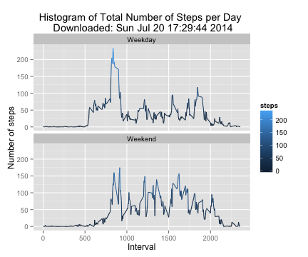

## Topics
1. Loading and Preprocessing Data  
1.1 Introduction  
1.2 Data
2. Plots  
2.1 What is the mean total number of steps taken per day?   
2.2 What is the average daily activity pattern?  
2.3 Imputing missing values  
2.4 Are there differences in activity patterns between weekdays and weekends?    
  
## 1. Loading and Preprocessing Data  
### 1.1 Introduction
This assignment makes use of data from a personal activity monitoring device. This device collects data at 5 minute intervals through out the day. The data consists of two months of data from an anonymous individual collected during the months of October and November, 2012 and include the number of steps taken in 5 minute intervals each day.  
  
  
Environment Used:  
  
  
- platform: x86_64-apple-darwin10.8.0                                                              
- R version: 3.1.0 (2014-04-10)
- RStudio version: 0.98.953


### 1.2 Data

The data for this assignment can be downloaded by [clicking here](https://d396qusza40orc.cloudfront.net/repdata%2Fdata%2Factivity.zip). The variables included in this dataset are:

- steps: Number of steps taking in a 5-minute interval (missing values are coded as NA)
- date: The date on which the measurement was taken in YYYY-MM-DD format
- interval: Identifier for the 5-minute interval in which measurement was taken

The dataset is stored in a comma-separated-value (CSV) file and there are a total of 17,568 observations in this dataset. The following code chunk can be used to download data:

- Downloading data

```r
TempZip <- tempfile()
download.file("https://d396qusza40orc.cloudfront.net/repdata%2Fdata%2Factivity.zip",TempZip,method="curl")
```
- Records the download date

```r
DownloadDate <- date()
```
- Uncompress the downloaded file

```r
TempFileName = unzip(TempZip, list=TRUE)$Name[1]
StepsDFrame <- data.frame(read.csv(unzip(TempZip, files=TempFileName, overwrite=TRUE), sep=",", header=TRUE))
unlink(TempZip)
```
  
  
## 2. Plots  

*Note: This code chunk will ignore missing values for all plots, except where otherwise stated.*

```r
StepsDFrame_No_NA <- na.omit(StepsDFrame)
```

### 2.1 What is the mean total number of steps taken per day?  
#### Histogram: Total number of steps taken each day  

```r
StepsTakenTable <- aggregate(steps ~ date, StepsDFrame_No_NA, sum)
hist(StepsTakenTable$steps, col=3, border=1, labels=TRUE, 
     main=paste("Histogram of Total Number of Steps per Day","\n","Downloaded:",DownloadDate), 
     xlab="Total number of steps in a day")
```

 
  
#### Mean: Total number of steps taken each day 


```r
mean(StepsTakenTable$steps)
```

```
## [1] 10766
```

#### Median: Total number of steps taken each day

```r
median(StepsTakenTable$steps)
```

```
## [1] 10765
```
  
### 2.2 What is the average daily activity pattern?    
#### Average number of steps averaged across all over days  

- Plot:

```r
StepsIntervalTable <- aggregate(steps ~ interval, StepsDFrame_No_NA, mean)
plot(StepsIntervalTable$interval, StepsIntervalTable$steps, type='l', col=3,
     main=paste("Average Number of Steps Averaged over All Days","\n","Downloaded:",DownloadDate),
     xlab="Interval",
     ylab="Average Number of Steps")  
```

 

- Maximum Average of Steps in a 5-minutes Interval

```r
StepsMaxIntervalRowId <- which.max(StepsIntervalTable$steps)
StepsIntervalTable [StepsMaxIntervalRowId, ]
```

```
##     interval steps
## 104      835 206.2
```
  
### 2.3 Imputing missing values
#### Number of Missing Values  

```r
nrow(StepsDFrame) - nrow(StepsDFrame_No_NA)
```

```
## [1] 2304
```
  
#### Imputation Process  
  
The "NA" values will be replaced (imputation) by the mean of the steps taken in an interval. The following code is loop to go over each observation, and replace the "NA" value:

```r
Counter <- 0
for (Counter in 1:nrow(StepsDFrame)){
  if (is.na(StepsDFrame$steps[Counter])){
    IntervalVal <- StepsDFrame$interval[Counter]
    Observation <- which(StepsIntervalTable$interval == IntervalVal)
    NumberOfSteps <- StepsIntervalTable$steps[Observation]
    StepsDFrame$steps[Counter] <- NumberOfSteps
  }
}
StepsTakenImputationTable <- aggregate(steps ~ date, StepsDFrame, sum)
```
  
- Difference in Mean Between Original and Imputed Dataset:

```r
mean (StepsTakenTable$steps) - mean(StepsTakenImputationTable$steps)
```

```
## [1] 0
```
  
- Difference in Median Between Original and Imputed Dataset:

```r
median (StepsTakenTable$steps) - median(StepsTakenImputationTable$steps)
```

```
## [1] -1.189
```

The histogram below plots the results after the imputation process:

```r
hist(StepsTakenImputationTable$steps, col=3, border=1, labels=TRUE, 
     main=paste("(Imputed) Histogram of Total Number of Steps per Day","\n","Downloaded:",DownloadDate),
     xlab="Total number of steps in a day")
```

 
  
### 2.4 Are there differences in activity patterns between weekdays and weekends?  
  
The following code creates a new variable to show if that date was a weekday or weekend:  


```r
StepsDFrame_No_NA$date <- as.Date(StepsDFrame_No_NA$date, "%Y-%m-%d")  ## Convert to date format
StepsDFrame_No_NA$dayofweek <- weekdays(StepsDFrame_No_NA$date) ## Name the day of the week in a new variable
Counter <- 0
for (Counter in 1:nrow(StepsDFrame_No_NA)){
  StepsDFrame_No_NA$weekdayclass[Counter] <- ## For each line, change to 'weekend' if 'Saturday' or 'Sunday' (else 'weekday')
      c(ifelse(
                StepsDFrame_No_NA$dayofweek[Counter] == "Saturday" || 
                StepsDFrame_No_NA$dayofweek[Counter] == "Sunday",
                "Weekend", "Weekday"))
  }
StepsDFrame_No_NA$weekdayclass <- as.factor(StepsDFrame_No_NA$weekdayclass) ## Conversion to allow the plots
StepsDFrameWeekdayClass <- aggregate(steps ~ interval+weekdayclass, StepsDFrame_No_NA, mean) ## Compute the mean by day type
```
  
- Plot:

```r
library(ggplot2)
qplot(interval, steps, data=StepsDFrameWeekdayClass, geom=c("line"), color=steps, xlab="Interval", 
      ylab="Number of steps",
      main=paste("Histogram of Total Number of Steps per Day","\n","Downloaded:",DownloadDate)) +
      facet_wrap(~ weekdayclass, ncol=1)
```

 
